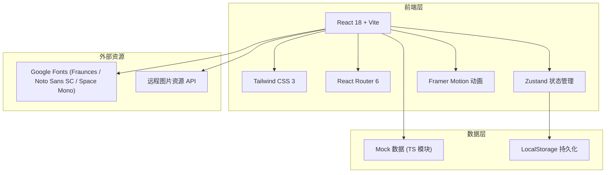
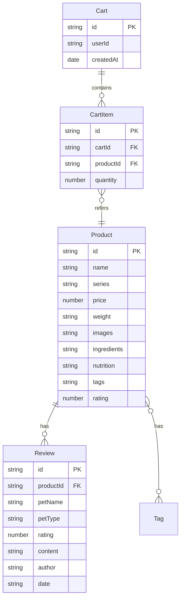

# 宠物零食售卖网站 - 技术架构文档

## 1. 架构设计



## 2. 技术说明

- **前端框架**：React@18 + Vite（快速冷启动与 HMR）
- **样式方案**：Tailwind CSS@3 + 自定义 CSS 变量（实现手作编辑式美学）
- **路由**：React Router@6（懒加载优化首屏）
- **状态管理**：Zustand（购物车 / 收藏 / 用户会话）
- **动画**：Framer Motion（页面切换、卡片 hover、滚动揭示）
- **初始化工具**：vite-init（`npm create vite@latest` React-TS 模板）
- **后端**：无（前端 mock 数据，结算流程在客户端模拟完成）
- **数据库**：无（使用 TypeScript 模块导出静态数据，购物车数据持久化到 localStorage）
- **图标**：内联 SVG（手绘风骨头、鱼骨、爪印等装饰元素）

## 3. 路由定义

| 路由 | 用途 |
|------|------|
| `/` | 首页（Hero、系列、畅销、品牌故事、原料溯源、评价、订阅） |
| `/products` | 商品列表页（筛选 + 网格） |
| `/products/:id` | 商品详情页 |
| `/cart` | 购物车页 |
| `/story` | 品牌故事页 |
| `*` | 404 兜底页 |

## 4. API 定义

无后端 API。所有数据来自前端 mock 模块：

```typescript
// src/data/products.ts
export interface Product {
  id: string;
  name: string;
  series: 'dog' | 'cat' | 'functional';
  petType: ('dog' | 'cat')[];
  price: number;
  weight: string;
  images: string[];
  ingredients: string[];
  nutrition: { label: string; value: string }[];
  feeding: string;
  tags: ('new' | 'bestseller' | 'hypoallergenic')[];
  rating: number;
  reviewCount: number;
  description: string;
}

export interface Review {
  id: string;
  productId: string;
  petName: string;
  petType: 'dog' | 'cat';
  rating: number;
  content: string;
  author: string;
  date: string;
}
```

## 5. 服务器架构

不适用（纯前端项目）。

## 6. 数据模型

### 6.1 数据模型关系



### 6.2 数据定义语言

无 SQL。Mock 数据以 TypeScript 模块形式提供，约 12-16 个商品（覆盖犬用 / 猫用 / 功能型三大系列），约 20-30 条评价数据，覆盖主要商品。

## 7. 项目结构

```
/workspace
├── index.html
├── package.json
├── vite.config.ts
├── tailwind.config.js
├── postcss.config.js
├── tsconfig.json
├── src/
│   ├── main.tsx
│   ├── App.tsx
│   ├── index.css
│   ├── data/
│   │   ├── products.ts
│   │   └── reviews.ts
│   ├── components/
│   │   ├── Navbar.tsx
│   │   ├── Footer.tsx
│   │   ├── ProductCard.tsx
│   │   ├── Button.tsx
│   │   ├── illustrations/         # 手绘风 SVG 装饰
│   │   └── ...
│   ├── sections/                  # 首页各区块
│   │   ├── Hero.tsx
│   │   ├── SeriesNav.tsx
│   │   ├── BestSellers.tsx
│   │   ├── BrandStory.tsx
│   │   ├── Traceability.tsx
│   │   ├── Reviews.tsx
│   │   └── Subscribe.tsx
│   ├── pages/
│   │   ├── Home.tsx
│   │   ├── Products.tsx
│   │   ├── ProductDetail.tsx
│   │   ├── Cart.tsx
│   │   └── Story.tsx
│   ├── store/
│   │   └── cartStore.ts           # Zustand store
│   └── utils/
│       └── format.ts
```

## 8. 关键实现细节

- **字体加载**：通过 `<link>` 引入 Google Fonts，使用 `font-display: swap` 避免阻塞
- **图片资源**：使用项目规定的远程图片 API（`https://remote-pod.enterprise.trae.cn/api/ide/v1/text_to_image`）按商品类型生成对应图片
- **纸张噪点纹理**：使用 SVG feTurbulence 滤镜叠加在背景层
- **手绘装饰**：内联 SVG 组件，颜色随主题色变量变化
- **购物车持久化**：Zustand 中间件 `persist` + localStorage
- **响应式断点**：`sm: 640, md: 768, lg: 1024, xl: 1280`（Tailwind 默认）
- **可访问性**：语义化 HTML、键盘可达、对比度符合 WCAG AA
